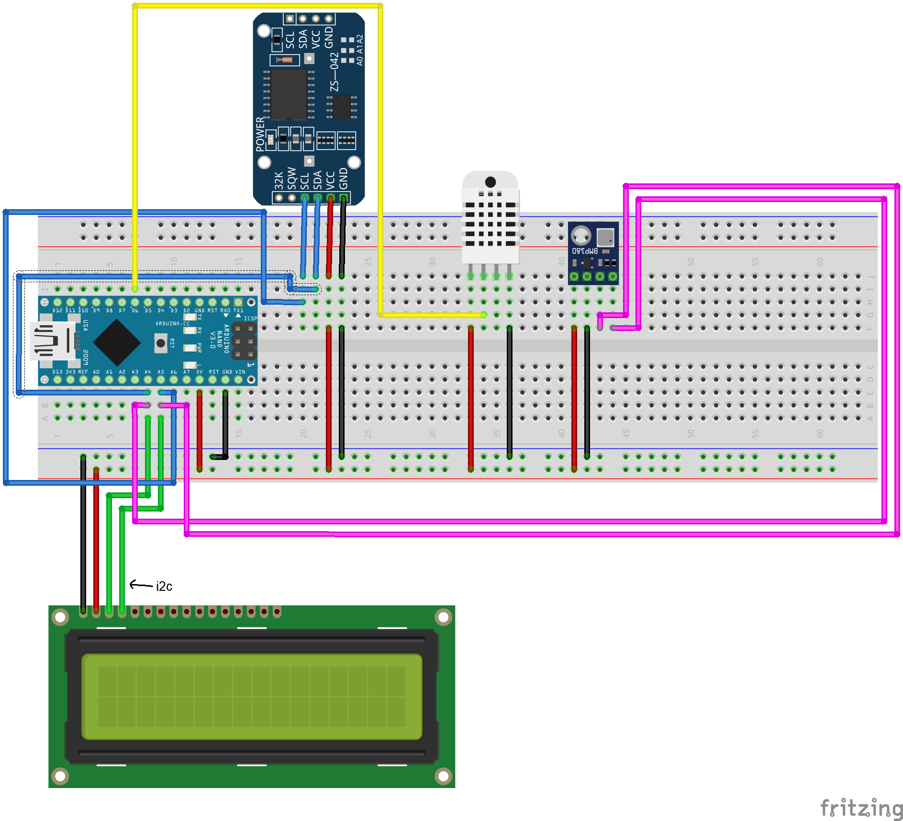

# The Arduino Weather Station

This device displays atmospheric pressure, temperature, and humidity. It also has the capability to send data through a COM port for further analysis.  
To use the Spplotter, you need to define the SPPLOTTER macro in the src/main.h.  
If you want to adjust the altitude above sea level, modify the value of the ALTITUDE constant variable located in src/main.h.  
**Used libraries:**
  * microDS3231 by gyver
  * DHT sensor library by adafruit
  * avr-debugger by jdolinay
  * LiquidCrystal_I2C by marcoschwartz
  * Sparkfun BMP180 by sparkfun
## Additional programs
In folder _programs there are 2 programs.
### comreader.exe
comreader.exe reads COM port data and writes it to file.  
Usage:
```
> comreader.exe <com_port_name>
```
### weatherreader.exe
weatherreader.exe reads file and writes to medium.txt medium indications.  
Usage:
```
> weatherreader.exe <file_to_read>
```
